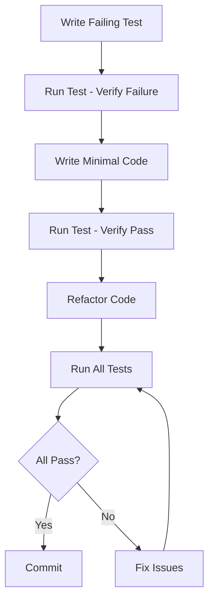

# PLANNING.md - ParcelExtract Project Planning Document

## 1. Project Architecture

### 1.1 System Architecture Overview

```
┌─────────────────────────────────────────────────────────────┐
│                     User Interface Layer                     │
├──────────────────────────┬──────────────────────────────────┤
│      CLI Interface       │         Python API               │
│   (parcelextract.cli)    │    (ParcelExtractor class)       │
└──────────────────────────┴──────────────────────────────────┘
                                    │
┌─────────────────────────────────────────────────────────────┐
│                    Core Processing Layer                     │
├──────────────────────────────────────────────────────────────┤
│  • Signal Extraction Engine (core/extractor.py)             │
│  • Strategy Pattern Implementation (core/strategies.py)      │
│  • Input Validation (core/validators.py)                    │
└─────────────────────────────────────────────────────────────┘
                                    │
┌─────────────────────────────────────────────────────────────┐
│                    Data Management Layer                     │
├─────────────────┬──────────────────┬───────────────────────┤
│   I/O Module    │  Atlas Manager   │   BIDS Compliance    │
│  (io/readers,   │  (atlases/       │   (io/bids.py)       │
│   writers)      │   manager)       │                      │
└─────────────────┴──────────────────┴───────────────────────┘
                                    │
┌─────────────────────────────────────────────────────────────┐
│                    External Dependencies                     │
├─────────────────┬──────────────────┬───────────────────────┤
│    Nibabel      │   TemplateFlow   │      Nilearn         │
│  (File I/O)     │  (Atlas Source)  │  (Neuro utilities)   │
└─────────────────┴──────────────────┴───────────────────────┘
```

### 1.2 Module Structure

```
parcelextract/
├── __init__.py                 # Empty - no code per guidelines
├── core/                       # Core processing logic
│   ├── __init__.py            # Empty
│   ├── extractor.py           # Main ParcelExtractor class
│   ├── strategies.py          # Extraction strategy implementations
│   └── validators.py          # Input/output validation
├── io/                        # Input/Output operations
│   ├── __init__.py            # Empty
│   ├── readers.py             # Nifti file reading utilities
│   ├── writers.py             # TSV/JSON output generation
│   └── bids.py               # BIDS naming and parsing
├── atlases/                   # Atlas management
│   ├── __init__.py            # Empty
│   ├── manager.py            # AtlasManager class
│   └── templateflow.py       # TemplateFlow integration
├── cli/                       # Command-line interface
│   ├── __init__.py            # Empty
│   └── main.py               # CLI entry point
├── utils/                     # Utility functions
│   ├── __init__.py            # Empty
│   ├── logging.py            # Logging configuration
│   └── helpers.py            # General utility functions
└── tests/                     # Test suite
    ├── __init__.py            # Empty
    ├── conftest.py           # Pytest fixtures
    ├── test_extractor.py     # Core extractor tests
    ├── test_strategies.py    # Strategy pattern tests
    ├── test_io.py           # I/O operation tests
    ├── test_atlases.py      # Atlas handling tests
    ├── test_cli.py          # CLI tests
    └── fixtures/            # Test data directory
        ├── synthetic_4d.nii.gz
        └── test_atlas.nii.gz
```

### 1.3 Design Patterns

#### Strategy Pattern
- **Purpose**: Support multiple extraction methods (mean, median, PCA, weighted)
- **Implementation**: Abstract `ExtractionStrategy` base class with concrete implementations
- **Location**: `core/strategies.py`

#### Factory Pattern
- **Purpose**: Create appropriate atlas loaders based on input type
- **Implementation**: `AtlasManager.load_atlas()` method
- **Location**: `atlases/manager.py`

#### Builder Pattern
- **Purpose**: Construct BIDS-compliant filenames (to the degree possible) with multiple optional components
- **Implementation**: `BIDSNameBuilder` class
- **Location**: `io/bids.py`

## 2. Technology Stack

### 2.1 Core Technologies

| Component | Technology | Version | Purpose |
|-----------|------------|---------|----------|
| Language | Python | 3.12+ | Primary development language |
| Package Manager | uv | >=0.8.14 | Modern, fast dependency management |
| Testing | pytest | >=7.0.0 | Test framework |
| Coverage | pytest-cov | >=4.0.0 | Code coverage reporting |

### 2.2 Scientific Computing Stack

| Library | Version | Purpose |
|---------|---------|----------|
| nibabel | >=3.2.0 | Neuroimaging file I/O (.nii, .nii.gz) |
| nilearn | >=0.10.0 | Neuroimaging data manipulation and utilities |
| numpy | >=1.20.0 | Numerical operations and array handling |
| pandas | >=1.3.0 | Data structuring for time-series output |
| scipy | >=1.7.0 | Scientific computing (PCA, statistics) |
| templateflow | >=0.8.0 | Brain atlas management and downloading |

### 2.3 Development Tools

| Tool | Purpose | Configuration |
|------|---------|---------------|
| ruff | Linting & formatting | line-length=100, all rules |
| mypy | Type checking | strict mode |
| pre-commit | Git hooks | Format, lint, type check |

## 3. Development Process & Workflow

### 3.1 Test-Driven Development (TDD) Workflow



### 3.2 Development Cycle

1. **Planning Phase** (Start of each session)
   - Read PLANNING.md
   - Check TASKS.md for current priorities
   - Review SCRATCHPAD.md for context

2. **Implementation Phase**
   - Write test first (test should fail)
   - Implement minimal solution
   - Verify test passes
   - Refactor for clarity/performance
   - Update documentation

3. **Validation Phase**
   - Run full test suite: `uv run pytest`
   - Check coverage: `uv run pytest --cov=parcelextract`
   - Run type checking: `uv run mypy parcelextract`
   - Run linting & formatting: `uv run ruff check parcelextract` and `uv run ruff format parcelextract`

4. **Documentation Phase**
   - Update docstrings
   - Update TASKS.md (mark completed)
   - Add notes to SCRATCHPAD.md

### 3.3 Git Workflow

```bash
# Feature branch workflow
git checkout -b feature/extraction-strategies
# ... develop with TDD ...
git add -A
git commit -m "feat: implement mean extraction strategy with tests"
git push origin feature/extraction-strategies
# Create PR for review
```

### 3.4 Commit Message Convention

```
<type>(<scope>): <subject>

<body>

<footer>
```

Types:
- `feat`: New feature
- `fix`: Bug fix
- `test`: Adding tests
- `docs`: Documentation changes
- `refactor`: Code refactoring
- `perf`: Performance improvements
- `chore`: Maintenance tasks

## 4. Required Tools & Setup

### 4.1 Development Environment Setup

```bash
# 1. Install Python 3.12+
python --version  # Verify 3.12+

# 2. Install uv package manager
curl -LsSf https://astral.sh/uv/install.sh | sh

# 3. Initialize project
uv init parcelextract
cd parcelextract

# 4. Add dependencies
uv add nibabel nilearn numpy pandas scipy templateflow

# 5. Add dev dependencies
uv add --dev pytest pytest-cov ruff mypy pre-commit

# 6. Setup pre-commit hooks
uv run pre-commit install
```

### 4.2 IDE Configuration

#### VS Code Extensions
- Python
- Pylance
- Ruff (charliermarsh.ruff)
- Python Test Explorer
- autoDocstring
- GitLens

#### VS Code Settings (`.vscode/settings.json`)
```json
{
    "python.linting.enabled": true,
    "ruff.enable": true,
    "ruff.lint.run": "onType",
    "ruff.format.enable": true,
    "python.testing.pytestEnabled": true,
    "python.testing.unittestEnabled": false,
    "editor.formatOnSave": true,
    "editor.defaultFormatter": "charliermarsh.ruff",
    "editor.rulers": [100]
}
```

### 4.3 Testing Tools Configuration

#### .pre-commit-config.yaml
```yaml
repos:
  - repo: https://github.com/astral-sh/ruff-pre-commit
    rev: v0.6.0
    hooks:
      - id: ruff
        args: [--fix]
      - id: ruff-format
  - repo: https://github.com/pre-commit/mirrors-mypy
    rev: v1.11.0
    hooks:
      - id: mypy
        additional_dependencies: [types-all]
```

#### pytest.ini
```ini
[tool:pytest]
testpaths = tests
python_files = test_*.py
python_functions = test_*
addopts = 
    -v
    --strict-markers
    --tb=short
    --cov=parcelextract
    --cov-report=term-missing
    --cov-report=html
    --cov-fail-under=90
```

#### pyproject.toml (ruff configuration)
```toml
[tool.ruff]
line-length = 100
target-version = "py312"

[tool.ruff.lint]
select = [
    "E",   # pycodestyle errors
    "W",   # pycodestyle warnings
    "F",   # pyflakes
    "I",   # isort
    "N",   # pep8-naming
    "D",   # pydocstyle
    "B",   # flake8-bugbear
    "S",   # flake8-bandit
    "C90", # mccabe complexity
    "UP",  # pyupgrade
    "RUF", # ruff-specific rules
]
ignore = [
    "D100", # Missing docstring in public module
    "D104", # Missing docstring in public package
]

[tool.ruff.lint.pydocstyle]
convention = "numpy"

[tool.ruff.lint.mccabe]
max-complexity = 10

[tool.ruff.format]
quote-style = "double"
indent-style = "space"
```

#### .coveragerc
```ini
[run]
source = parcelextract
omit = 
    */tests/*
    */__init__.py

[report]
exclude_lines =
    pragma: no cover
    def __repr__
    raise AssertionError
    raise NotImplementedError
    if __name__ == .__main__.:
```

## 5. Development Phases & Milestones

### Phase 1: Core Foundation (Weeks 1-4)
- [ ] Project structure setup
- [ ] Basic validators implementation
- [ ] Mean extraction strategy
- [ ] Simple file I/O (readers/writers)
- [ ] Core test framework
- **Milestone**: Basic extraction working with synthetic data

### Phase 2: Atlas Integration (Weeks 5-6)
- [ ] Atlas manager implementation
- [ ] TemplateFlow integration
- [ ] Atlas metadata handling
- [ ] Multiple atlas format support
- **Milestone**: Successfully load and use TemplateFlow atlases

### Phase 3: Advanced Features (Weeks 7-8)
- [ ] Median extraction strategy
- [ ] PCA extraction strategy
- [ ] Weighted mean strategy
- [ ] Confound regression support
- [ ] Batch processing
- **Milestone**: All extraction strategies functional

### Phase 4: BIDS Compliance (Weeks 9-10)
- [ ] BIDS naming implementation
- [ ] JSON sidecar generation
- [ ] Entity preservation
- [ ] Derivatives naming
- **Milestone**: Full BIDS compliance achieved

### Phase 5: CLI & Polish (Weeks 11-12)
- [ ] CLI implementation
- [ ] Progress indicators
- [ ] Comprehensive documentation
- [ ] Example notebooks
- [ ] Performance optimization
- **Milestone**: v1.0.0 release ready

## 6. Quality Assurance Checklist

### 6.1 Code Quality Standards
- [ ] All functions have type hints
- [ ] All public APIs have docstrings
- [ ] Code follows PEP 8 (via ruff)
- [ ] No mypy errors
- [ ] No ruff violations
- [ ] Maximum line length: 100 characters

### 6.2 Testing Standards
- [ ] Minimum 90% code coverage
- [ ] All edge cases tested
- [ ] Integration tests for workflows
- [ ] Performance benchmarks met
- [ ] Tests run in <60 seconds

### 6.3 Documentation Standards
- [ ] README.md complete
- [ ] API documentation generated
- [ ] CLI help text comprehensive
- [ ] Example notebooks provided
- [ ] Installation guide tested

## 7. Performance Benchmarks

### 7.1 Target Metrics
| Operation | Target | Maximum |
|-----------|--------|---------|
| Single 4D image (200 timepoints, 3mm) | <30s | 60s |
| Batch processing (10 subjects) | <5min | 10min |
| Memory usage (peak) | <4GB | 8GB |
| Atlas loading | <5s | 10s |

### 7.2 Performance Testing
```python
# Performance test template
import time
import tracemalloc

def test_performance_single_extraction():
    tracemalloc.start()
    start_time = time.time()
    
    # Extraction code here
    
    elapsed = time.time() - start_time
    current, peak = tracemalloc.get_traced_memory()
    tracemalloc.stop()
    
    assert elapsed < 30  # seconds
    assert peak / 1024 / 1024 < 4096  # MB
```

## 8. Continuous Integration Pipeline

### 8.1 GitHub Actions Workflow
```yaml
name: CI
on: [push, pull_request]
jobs:
  test:
    runs-on: ${{ matrix.os }}
    strategy:
      matrix:
        os: [ubuntu-latest, macos-latest]
        python-version: [3.12]
    steps:
      - uses: actions/checkout@v2
      - name: Set up Python
        uses: actions/setup-python@v4
        with:
          python-version: ${{ matrix.python-version }}
      - name: Install uv
        run: curl -LsSf https://astral.sh/uv/install.sh | sh
      - name: Install dependencies
        run: |
          uv sync
          uv add --dev pytest pytest-cov ruff mypy
      - name: Lint with ruff
        run: uv run ruff check parcelextract
      - name: Format check with ruff
        run: uv run ruff format --check parcelextract
      - name: Type check with mypy
        run: uv run mypy parcelextract
      - name: Run tests
        run: uv run pytest --cov=parcelextract
      - name: Upload coverage
        uses: codecov/codecov-action@v3
```

## 9. Release Process

### 9.1 Release Checklist
1. [ ] All tests passing
2. [ ] Coverage >90%
3. [ ] Documentation updated
4. [ ] CHANGELOG.md updated
5. [ ] Version bumped in pyproject.toml
6. [ ] Git tag created
7. [ ] GitHub release created
8. [ ] Package published to PyPI

### 9.2 Semantic Versioning
- MAJOR: Breaking API changes
- MINOR: New features (backwards compatible)
- PATCH: Bug fixes

## 10. Risk Mitigation Strategies

### 10.1 Technical Risks
| Risk | Mitigation |
|------|------------|
| Memory overflow with large datasets | Implement chunked processing |
| Atlas format inconsistencies | Comprehensive validation layer |
| BIDS spec changes | Abstract BIDS handling |
| Dependency conflicts | Pin versions, test matrix |

### 10.2 Project Risks
| Risk | Mitigation |
|------|------------|
| Scope creep | Strict PRD adherence |
| Test coverage gaps | TDD enforcement |
| Performance degradation | Continuous benchmarking |
| Documentation lag | Doc-as-you-code policy |

## 11. Communication & Collaboration

### 11.1 Documentation Files
- **CLAUDE.md**: Project guide and quick reference
- **PRD.md**: Complete requirements specification
- **PLANNING.md**: This file - architecture and process
- **TASKS.md**: Current task tracking
- **SCRATCHPAD.md**: Working notes and ideas
- **CHANGELOG.md**: Version history

### 11.2 Code Review Criteria
- Tests pass and coverage maintained
- Type hints present
- Docstrings complete
- No ruff violations
- Performance benchmarks met
- Documentation updated

## 12. Quick Command Reference

```bash
# Project setup
uv init
uv add nibabel nilearn numpy pandas scipy templateflow
uv add --dev pytest pytest-cov ruff mypy

# Development
uv run pytest                           # Run tests
uv run pytest --cov=parcelextract       # Run with coverage
uv run pytest tests/test_extractor.py   # Run specific test
uv run ruff format parcelextract        # Format code
uv run ruff check parcelextract         # Lint code
uv run ruff check --fix parcelextract   # Lint and auto-fix
uv run mypy parcelextract               # Type check

# Usage
uv run python -m parcelextract.cli.main --help
uv run python -c "from parcelextract import ParcelExtractor"
```

---

**Last Updated**: August 2025  
**Next Review**: After Phase 1 completion
